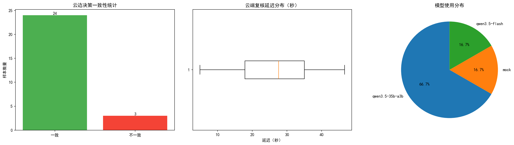

# 本科生4学习记录

## 个人信息

- 姓名：许梓涵
- 负责模块：cloud（云端 GCM 复核）
- 分支：feature/cloud-gcm-review

## 学习内容

### 1. 项目架构理解

本项目是一个云边协同 AI4I 系统，核心模块包括：
- **edge**：边缘节点本地感知与轻量推理
- **federated**：Flower 联邦学习实验
- **cloud**：云端 GCM / 大模型复核接口（我负责）
- **routing**：云边协同动态路由
- **consistency**：多边缘节点冲突检测与仲裁
- **dashboard**：可视化展示页面

### 2. 云端 GCM 复核模块

负责实现云端大模型复核功能，主要工作：
- 封装 Qwen3.5-35B / Qwen3-14B API 调用
- 对边缘低置信度/高风险样本进行云端复核
- 汇总边缘与云端结果，输出最终决策
- 提供 FastAPI 服务接口

### 3. API 调用方式

- **Qwen3.5-35B**：使用 Responses API（`client.responses.create()`）
- **Qwen3-14B**：使用 Chat Completions API（`client.chat.completions.create()`）
- 支持 Mock/Real 双模式切换
- 具备自动降级机制（主模型失败自动切换备用模型）

### 4. 开发规范

- 不直接修改 main 分支
- 在自己的功能分支开发，完成后提交 Pull Request
- 使用 `.env` 文件管理敏感配置（不上传 GitHub）
- 提交信息规范：`feat(模块): 功能描述`

## 完成情况

| 任务 | 状态 | 备注 |
|------|------|------|
| 环境配置 | ✅ | Git、Anaconda、VS Code 已安装 |
| 仓库克隆 | ✅ | 已克隆到本地 |
| 依赖安装 | ✅ | `pip install -r requirements.txt` |
| 分支创建 | ✅ | feature/cloud-gcm-review |
| 代码实现 | ✅ | cloud 模块完整实现 |
| 测试验证 | ✅ | Mock 和 Real 模式均通过 |
| PR 提交 | ✅ | 已提交最小 PR |

## 成功运行记录

### 测试时间：2026-07-05 18:00

### 运行命令
```bash
python -m cloud.cloud_review
```

### 测试结果

| 测试用例 | 设备ID | 边缘故障 | 云端故障 | 一致性 | 延迟 | 使用模型 |
|---------|--------|---------|---------|-------|------|---------|
| 测试用例1 | device_001 | Heat Dissipation Failure | Heat Dissipation Failure | ✅ 一致 | 15388ms | qwen3.5-35b-a3b |
| 测试用例2 | device_002 | Normal | Normal | ✅ 一致 | 20360ms | qwen3.5-35b-a3b |
| 测试用例3 | device_003 | Power Failure | Power Failure | ✅ 一致 | 38932ms | qwen3.5-35b-a3b |

### 统计信息
- **云边一致性**：100%
- **平均延迟**：24893ms
- **云端调用次数**：3次

### 复核理由示例
- **测试用例1**：工艺温度超预警阈值，空气/工艺温差不符合常规散热曲线，扭矩未补偿性下降，符合热失效特征
- **测试用例2**：环境温度与工艺温差正常，转速与扭矩稳定，工具磨损量在安全范围内，无异常模式
- **测试用例3**：转速与扭矩均为零确认为非运行状态，环境温度正常排除过热故障，符合电源失效特征

### 运行模式
- **模式**：Real（真实 API 调用）
- **使用模型**：Qwen3.5-35B（主模型）
- **备用模型**：Qwen3-14B（未触发降级）

## 统计图表



图表说明：
1. **云边决策一致性统计**：展示云端与边缘决策一致/不一致的样本数量
2. **云端复核延迟分布**：展示真实 API 调用的延迟分布情况（单位：秒）
3. **模型使用分布**：展示主模型与备用模型的使用比例