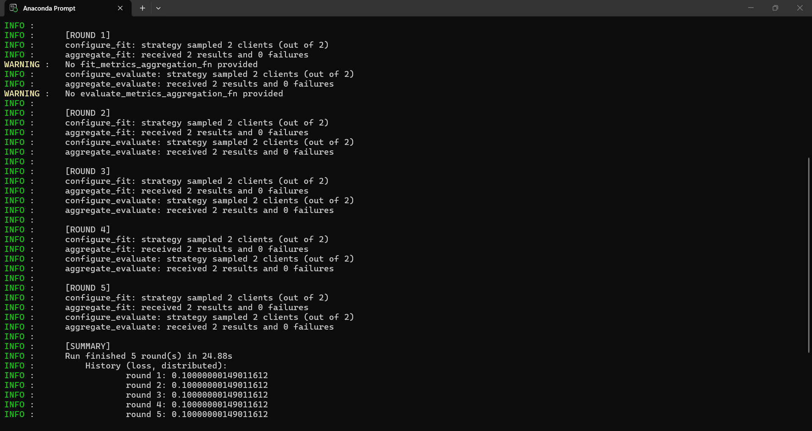

# 第1周 Flower Quickstart 实验记录
姓名：计星宇
模块：federated 联邦学习
## 一、文件说明
1. quickstart_test.py：Flower官方适配版联邦训练代码，实现FedAvg聚合
2. 运行方式：单服务端 + 2个本地客户端，5轮联邦迭代

## 二、运行步骤
1. 打开Anaconda Prompt，激活环境 conda activate cloudedge
2. 第一个终端启动服务端：
   python federated/quickstart_test.py server
3. 新开2个终端分别启动客户端：
   python federated/quickstart_test.py client
4. 等待5轮训练结束，查看每轮loss、accuracy输出

## 三、核心理论对应代码
1. FedAvg加权平均：代码中fl.server.strategy.FedAvg，按各客户端样本数量加权聚合模型参数
2. 联邦学习流程：客户端本地训练→上传参数→服务端聚合→下发全局模型
3. 非IID铺垫：当前使用模拟均匀数据，下周替换本科生1提供的5份AI4I非IID客户端csv

## 四、运行结果说明
成功启动1个服务端、2个客户端，完整跑完5轮FedAvg联邦训练。
客户端正常接收train、evaluate指令，训练结束收到断开信号正常退出。

## 五、遇到的问题与解决
1.Tensor 带梯度直接转 numpy 报错 → 使用 .detach().cpu().numpy()
2.10061 连接拒绝 → 严格遵守【先启动服务端，等待就绪后再启动客户端】
3.IP 地址格式、端口缺失引发解析报错 → 统一地址 127.0.0.1:8080

## 六、下周计划
1. 对接data/ai4i下划分好的5个Non-IID客户端数据
2. 改造client.py读取真实工业数据集，替换模拟dummy数据
3. 输出local_vs_fedavg_comparison.csv对比本地单模型与联邦模型指标