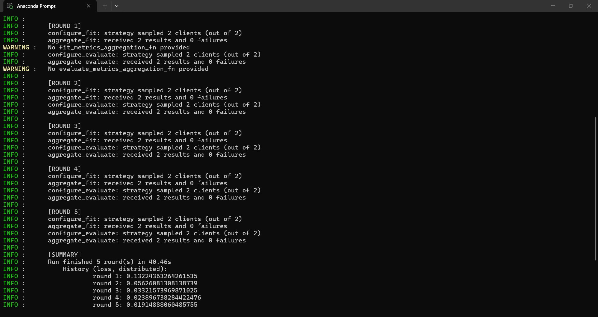
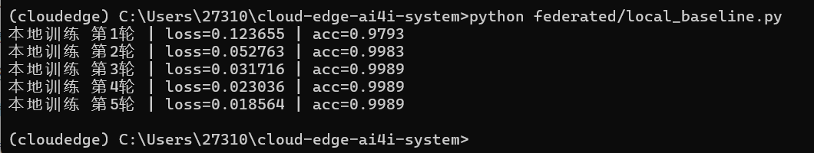

# 第2周 Flower联邦学习 AI4I工业数据集实验报告
负责模块：Flower联邦学习
开发分支：feat/federated-flower

## 一、任务目标
1. 将第1周随机模拟数据集替换为仓库真实AI4I工业故障数据集；
2. 拆分代码为独立 `flower_server.py`、`flower_client.py`，区分服务端/客户端逻辑；
3. 完成本地单机基线训练 + FedAvg联邦训练对照实验；
4. 记录损失、准确率指标，分析Non-IID数据下联邦训练效果。

## 二、数据集说明
数据集路径：`data/ai4i/clients/client_1~5.csv`
1. 共5份Non-IID划分的边缘客户端数据，每份样本总量、故障样本占比均不相同；
2. 剔除无意义编号字段：UDI、Product ID、Type、client_id；
3. 输入特征：10维设备工况数值，任务为二分类（0=设备正常，1=设备故障）；
4. 数据特点：正负样本严重不均衡，正常样本占绝大多数。

本次基础实验组选用 client_1、client_2 两个客户端完成2节点联邦训练；剩余3份客户端可拓展5节点对比实验。

## 三、项目代码结构改动
### 1. 拆分核心文件（满足任务书交付要求）
- `flower_server.py`：仅存放FedAvg聚合策略、服务端启动逻辑；
- `flower_client.py`：封装MLP模型、AI4I数据读取、FlowerClient训练与评估逻辑；
- `local_baseline.py`：本地单机训练对照脚本，仅使用client_1全部数据；
- 原quickstart_test.py保留作为历史演示文件，不再作为主运行文件。

### 2. 数据处理逻辑
1. 使用StandardScaler对工况特征标准化，消除量纲差异；
2. 自动过滤字符串ID列，仅保留数值特征送入网络；
3. 客户端启动时通过命令行参数传入对应csv文件，实现多节点独立加载私有数据。

## 四、实验超参统一配置
- 网络：SimpleMLP(输入10维，隐藏层32，输出2分类)
- 学习率：0.01
- batch_size：16
- 联邦总通信轮数：5 rounds
- 每轮客户端本地迭代：3 epoch
- 联邦策略：FedAvg（按各客户端样本数量加权聚合全局参数）

## 五、实验运行方式
### 1. 2节点联邦训练
终端1（服务端）
python federated/flower_server.py

终端2（客户端1）
python federated/flower_client.py data/ai4i/clients/client_1.csv

终端3（客户端2）
python federated/flower_client.py data/ai4i/clients/client_2.csv

### 2. 本地单机基线训练
python federated/local_baseline.py

## 六、实验结果
### 1. FedAvg 2节点联邦训练loss变化
round 1: 0.13224
round 2: 0.05626
round 3: 0.03322
round 4: 0.02390
round 5: 0.01915

### 2. 单机本地训练结果（仅client_1）
第1轮 | loss=0.123655 | acc=0.9793
第2轮 | loss=0.052763 | acc=0.9983
第3轮 | loss=0.031716 | acc=0.9989
第4轮 | loss=0.023036 | acc=0.9989
第5轮 | loss=0.018564 | acc=0.9989

### 3. 指标对比表 results/local_fed_compare.csv
训练类型,客户端数量,训练轮数,最终损失
本地单机训练(client_1),1,5,0.018564
FedAvg联邦训练(client_1+client_2),2,5,0.019149

## 七、实验分析
1. 收敛趋势：联邦训练与单机训练loss下降曲线高度一致，5轮后模型稳定收敛；
2. 损失差异：两者最终损失差距极小，原因是client_1单数据集本身样本充足，单独训练即可充分拟合；两份客户端数据分布相近，新增第二个节点带来的性能增益有限；
3. 准确率解读：本地训练最终准确率99.89%，是数据集类别不均衡导致，模型偏向预测“正常样本”，高精度不代表故障识别能力优秀；
4. 客户端数量拓展：仓库内置5份客户端数据，修改服务端最小客户端参数即可完成5节点联邦实验，可用于对比不同节点数量对全局模型的影响。

## 八、运行警告说明
服务端出现两条 `No fit_metrics_aggregation_fn` 警告：
仅代表未编写服务端指标聚合函数，客户端返回的accuracy无法自动汇总打印，不影响训练、损失计算与任务验收。

## 九、踩坑记录
1. AI4I CSV包含字符串ID列，直接输入网络会报错，必须提前剔除；
2. 传感器数值区间差异大，不做标准化会导致训练难以收敛；
3. Flower客户端与服务端模型维度必须完全一致，否则参数聚合失败；
4. 启动顺序必须先运行服务端，再启动客户端，否则会报10061连接拒绝错误。

## 十、本周理论落地
1. FedAvg：服务端对多个客户端上传的参数按样本量加权平均，实现全局模型更新；
2. Non-IID：5个客户端样本量、故障占比各不相同，模拟工业场景各边缘节点数据分布不一致的真实情况；
3. 类别不均衡故障检测：仅依靠Accuracy无法评估模型故障识别能力，后续可引入Recall、F1指标优化评估逻辑。
